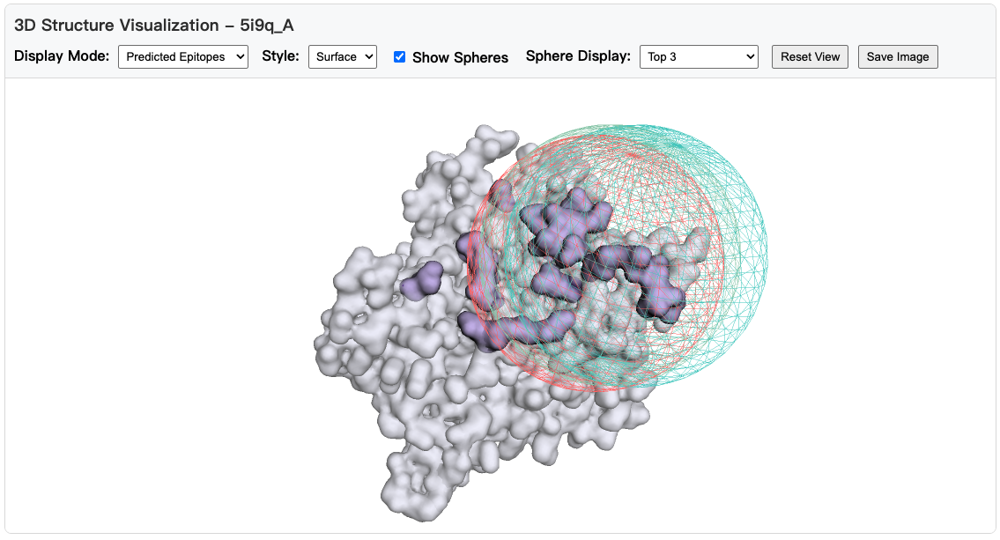

# RoBep
## Website
RoBep provides a user-friendly web interface accessible through [Hugging Face Spaces](https://huggingface.co/spaces/NielTT/RoBep). This interface allows you to easily predict epitope residues without any local installation.

### How to Use the Web Interface

1. **Accessing the Website**
   - Visit https://huggingface.co/spaces/NielTT/RoBep
   - Note: If you see a "restart" message, please wait for a few minutes as the service initializes

2. **Input Options**
   - Option 1: Enter a PDB ID and Chain ID
   - Option 2: Upload your own PDB file
   - Note: If you only have a protein sequence, you can obtain its predicted structure using AlphaFold3 [https://alphafoldserver.com/]

3. **View Results**
   - After processing (typically several seconds to 1-2 minutes), you'll see the prediction results
   - An interactive HTML visualization will be available for download

4. **Visualization Options**
   - Three display modes are available:
     * Predicted Epitopes: Shows the predicted epitope residues
     * Probability Gradient: Displays probability scores (darker color indicates higher probability)
     * Top-k Regions: Highlights predicted binding regions
   - Additional Features:
     * Use "Show Spheres" to visualize the selected spheres used in epitope prediction
     * Interact with the 3D structure using mouse controls (rotate, zoom, pan)



## Data Introduction

All data used for this work are located in the `data/epitopes/` directory:

### Dataset Split Information
- **`data_splits.json`**: Contains the PDB IDs with chain identifiers for all training and test antigens

### Complete Dataset
- **`epitopes.csv`**: Contains all non-redundant antigens with their sequences and merged epitope annotations
- **`virus_nsp.csv`**: Contains 85 non-structural proteins from virus
- **`cluster.csv`**: Contains representative antigen with corresponding member antigens in each cluster
### Training and Testing Subsets

**FASTA Sequences:**
- **`train_antigens.fasta`**: Sequences of all antigens used for training
- **`test_antigens.fasta`**: Sequences of all antigens used for testing

**Detailed Annotations:**
- **`train_epitopes.csv`**: All non-redundant antigens in the training set, including sequences and merged epitope annotations
- **`test_epitopes.csv`**: All non-redundant antigens in the test set, including sequences and merged epitope annotations

### Obtaining Protein Structures

The corresponding protein structures can be obtained from:
- **PDB Database**: Download experimentally determined structures from [RCSB PDB](https://www.rcsb.org/)
- **AlphaFold Prediction**: Generate predicted structures using [AlphaFold Server](https://alphafoldserver.com/)

## Environment Install
```bash
git clone https://github.com/YitaoXU/RoBep.git
cd RoBep

conda create -n RoBep python=3.10 -y
conda activate RoBep

# Install PyTorch and basic dependencies first
pip install -r requirements.txt

# Install PyTorch Geometric dependencies
pip install torch-scatter torch-sparse torch-cluster torch-spline-conv -f https://data.pyg.org/whl/torch-2.5.0+cu124.html

# Install the package in development mode
pip install -e .
```

## Inference
### Data Preparation
```python
# Recommend to save the PDB file locally and load it directly
# Please input your own ESM-C api token
from bce.antigen.antigen import AntigenChain

pdb_id = "5i9q"
chain_id = "A"

# specify your own ESM API token for embedding generation
antigen_chain = AntigenChain.from_pdb(
    path='data/pdb/5i9q.pdb', 
    id=pdb_id, 
    chain_id=chain_id,
    token="your_esm_api_token_here"  # Optional: your ESM API token
)

embeddings, backbone_atoms, rsa, coverage_dict= antigen_chain.data_preparation(radius=19.0)
```

### Epitope Prediction
You can see our [tutorials](notebooks/example.ipynb) to learn how to use RoBep.

```python
prediction_results = antigen_chain.predict(
    device_id=0,
    radius=18.0,
    k=7,
    encoder="esmc",
    verbose=True,
    use_gpu=False
)
```

#### Understanding the Prediction Results

The `predict()` function returns a comprehensive dictionary containing the following key information:

```python
{
    # Main Results
    'predicted_epitopes': [12, 15, 23, 45, 67, ...],  # List of predicted epitope residue numbers
    'predictions': {1: 0.02, 2: 0.15, 3: 0.85, ...}, # Dict: {residue_number: probability} (if > 0.3525, then predicted as epitope)
    
    # Top-k Region Information
    'top_k_centers': [15, 45, 78, ...],               # Center residues of top-k regions
    'top_k_region_residues': [12, 13, 14, 15, ...],   # All residues covered by top-k regions
    'top_k_regions': [                                # Detailed information for each region
        {
            'center_residue': 15,                      # Center residue number
            'center_idx': 14,                          # Center residue index (0-based)
            'predicted_value': 0.85,                   # Model confidence score
            'covered_residues': [12, 13, 14, 15, 16], # Residues in this region
            'radius': 18.0                             # Radius used
        },
        ...
    ],
    
    'epitope_rate': 0.15                              # Antigenicity (if >0.525, then antigenic)
}
```

## Evaluation
```bash
python -u main.py --mode eval --model_path models/RoBep/20250626_110438/best_mcc_model.bin --radius 18.0 --k 7

```

## Training
```bash
# Data Preparation (1 hour)
python data_preparation.py

# Training
python main.py --mode train
```


<!-- ### User friendly website
```bash
conda activate RoBep
pip install -r src/bce/website/requirements.txt

cd src/bce/website

python run_server.py --host 0.0.0.0 --port 8000
``` -->
